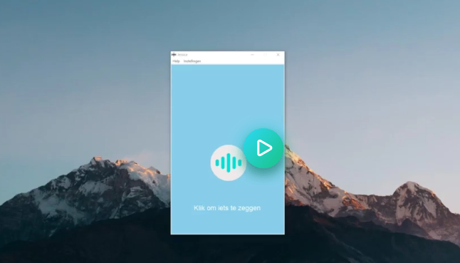

# Jessica
Nederlandse persoonlijke voice assistente gemaakt met Python!

# Download

Let op: Wanneer er een Windows defender pop-up verschijnt : Klik op "Meer informatie" en vervolgens op "Voer toch uit".

## Benodigdheden
- Spraakinvoer device (bijv. een microfoon)
- Geluidsuitvoer device (bijv. een koptelefoon)
- Een systeem draaiend op Windows (10 is getest)

## Hoe te gebruiken?
1. Open de snelkoppeling van Jessica in de map Jessica
2. Klik op het spraakicoontje boven de tekst "Klik om iets te zeggen" Jessica zal vanaf dit moment maximaal 5 seconden luisteren naar jouw vraag of commando
3. Voorbeeld: "Jessica vertel eens een mop"
4. Jessica zal hierop antwoorden en vervolgens zal de tekst "Aan het luisteren.." verdwijnen
5. Herhaal stap 2 om voor de volgende vraag of commando

## Commando's
### Standaard commando's
| Commando | Uitleg |
| ----------- | ----------- |
| Hoe laat is het Jessica? | Vraagt de tijd op |
| Jessica, wat is de datum? | Vraagt de datum op |
| Jessica, vertel eens een mop | Vertelt een mop |
| Jessica, start muziek Walk of Life | Speelt muziek af op YouTube! |
| Jessica, wat voor weer is het vandaag? | Verteld het weerbericht Let op : Hiervoor is een API key nodig. Vraag deze op in "instellingen" |

### Rekenen 1+1=3?
Jessica kan plus, min, keer, gedeeld door en machtsommen berekenen!

| Commando | Uitleg |
| ----------- | ----------- |
| Jessica, reken uit 10 keer 10 | Rekent een keer som uit |
| Jessica, bereken 10 min 10 |  	Rekent een min som uit | 
| Jessica, reken uit 10 plus 10 |  	Rekent een plus som uit |
| Jessica, bereken 10 gedeeld door 10 | Rekent een deel som uit |
| Jessica, reken uit 10 tot de macht 10 | Rekent een macht som uit |

### Overig maar awesome..

| Commando | Uitleg |
| ----------- | ----------- |
| Jessica, goedemorgen | Samenvatting om de dag mee te beginnen! |
| Jessica, wat zijn de Corona statistieken? |  	Vertelt de Corona statistieken! |
| Jessica, heb ik overgewicht? Of: Jessica wat is mijn BMI? | Berekend jouw BMI |

## Help
Mocht er iets fout gaan, dan verneem ik dat graag via https://github.com/1ncendium/Jessica/issues
